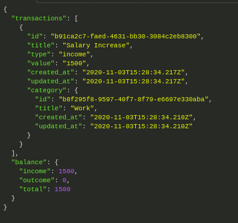
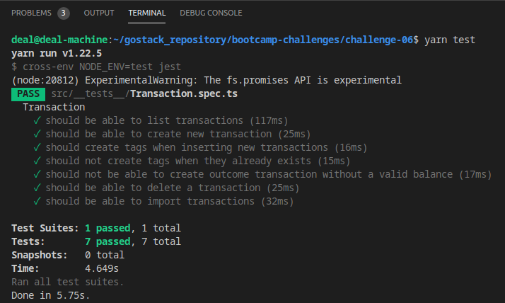

# deal-machine :white_check_mark:

<ul>
<li>NodeJS - Typescript</li>
<li>Express and routes</li>
<li>TypeORM Database and Migrations </li>
<li>Multer and upload files</li>
<li>Docker and PostgresSQL</li>
</ul>

<h2>Bootcamp GoStack Challenge 6 <b>Complete</b> :heavy_check_mark:
</h2>

Essa aplicação armazena transações financeiras de entrada e saída e permite o cadastro e a listagem dessas transações, além da criação de novos registros no banco de dados a partir do envio de um arquivo csv.

<h3>Rotas da aplicação</h3>
<ul>
  <li><b>POST /transactions</b> A rota recebe title, value, type, e category dentro do corpo da requisição, sendo o type o tipo da transação, que pode ser 'income' para entradas (depósitos) e 'outcome' para saídas (retiradas). Ao cadastrar uma nova transação, ela é armazenada dentro do banco de dados através da lib <a href="https://typeorm.io/#/" target="_blank">typeORM</a>, possuindo os campos id que é um <b>uuid</b>, title, value, type, category_id que é uma <b>foreign key</b> com a tabela <i>categories,created_at,updated_at</i>.</li>
  <li><b>GET /transactions</b> Essa rota retornar uma listagem com todas as transações no banco de dados, junto com o valor da soma de entradas, retiradas e total de crédito. Essa rota deve retornar um objeto o seguinte formato:</li>
  
   <li><b>DELETE /transactions/:id</b> A rota deleta uma transação no banco de dados;</li>
  <li><b>POST /transactions/import</b> A rota permite a importação de um arquivo com formato .csv contendo as informações necessárias para criação de uma transação <i>id, title, value, type, category_id, created_at, updated_at</i>, onde cada linha do arquivo CSV é um novo registro para o banco de dados, e por fim retorna todas as <i>transactions</i> que foram importadas para o banco.</li>
</ul>
 
<h3>Especificação dos testes</h3>

<ul>
  <li><b>should be able to create a new transaction</b> Para que esse teste passe, sua aplicação deve permitir que uma transação seja criada, e retorne um json com a transação criado.</li>
<li><b>should create tags when inserting new transactions</b> Para que esse teste passe, sua aplicação deve permitir que ao criar uma nova transação com uma categoria que não existe, essa seja criada e inserida no campo category_id da transação com o id que acabou de ser criado.</li>
<li><b>should not create tags when they already exists</b> Para que esse teste passe, sua aplicação deve permitir que ao criar uma nova transação com uma categoria que já existe, seja atribuído ao campo category_id da transação com o id dessa categoria existente, não permitindo a criação de categorias com o mesmo title.</li>
<li><b>should be able to list the transactions</b> Para que esse teste passe, sua aplicação deve permitir que seja retornado um array de objetos contendo todas as transações junto ao balanço de income, outcome e total das transações que foram criadas até o momento.</li>
<li><b>should not be able to create outcome transaction without a valid balance</b> Para que esse teste passe, sua aplicação não deve permitir que uma transação do tipo outcome extrapole o valor total que o usuário tem em caixa (total de income), retornando uma resposta com código HTTP 400 e uma mensagem de erro no seguinte formato: { error: string }.</li>
<li><b>should be able to delete a transaction</b> Para que esse teste passe, você deve permitir que a sua rota de delete exclua uma transação, e ao fazer a exclusão, ele retorne uma resposta vazia, com status 204.</li>
<li><b>should be able to import transactions</b> Para que esse teste passe, sua aplicação deve permitir que seja importado um arquivo csv, contendo o seguinte modelo. Com o arquivo importado, você deve permitir que seja criado no banco de dados todos os registros e categorias que estavam presentes nesse arquivo, e retornar todas as transactions que foram importadas.</li>
</ul>
